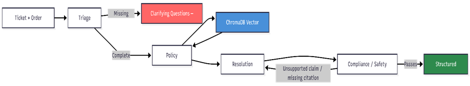

# E-Commerce Support Agent — Write-up

## Architecture Overview

Four-agent pipeline orchestrated via LangChain, with state flowing through a `TicketState` object. The Compliance agent is the final gatekeeper enforcing hallucination control before any response is returned.

### Technology Stack

| Component | Implementation |
|---|---|
| Orchestration | LangChain |
| Vector Store | ChromaDB (persistent local storage) |
| Embeddings | sentence-transformers/all-MiniLM-L6-v2 (384-dim) |
| LLM | Groq llama-3.3-70b-versatile |
| Chunking | 500 tokens, 50-token overlap |
| Retriever | Top-k = 4 |
| Structured Outputs | Pydantic models |

---

## Agent Responsibilities + Prompts (High Level)

**Triage** — Classifies issue type (refund / shipping / payment / promo / fraud / other), flags missing fields, generates up to 3 clarifying questions. Exits immediately if required fields are absent — no DB query. Prompt: structured JSON schema output; explicitly told not to infer missing values.

**Policy Retriever** — Pure vector search against ChromaDB. Returns top-4 chunks with doc title, chunk ID, and source. No LLM prompt — metadata passed downstream as citations.

**Resolution Writer** — Drafts decision (`approve` / `deny` / `partial` / `escalate`), rationale, citations, customer response, and internal notes using only retrieved evidence. Prompt: *"Do not add information not in the retrieved chunks. Every claim must map to a citation. If evidence is insufficient, output escalate."*

**Compliance / Safety** — Reviews draft for unsupported claims, missing citations, policy violations, and sensitive data leakage. Forces rewrite loop or escalates. Prompt: *"If any claim is unsupported or a citation is missing, return the draft with specific feedback for rewrite."* Hard rule: output is blocked until all claims are citation-backed.

---

## Data Sources

12 synthetic markdown files in `src/policies/` covering:

| Category | Topics |
|---|---|
| Returns & Refunds | Final sale, hygiene items, perishables |
| Cancellations | Order modification rules |
| Shipping & Delivery | Lost packages, guarantees |
| Promotions | Coupon stacking rules |
| Disputes | Damaged / missing items |

All documents are synthetic — no external URLs. Chunking: 500 tokens, 50-token overlap — designed to avoid duplicate evidence and improve retrieval clarity.

---

## Evaluation Summary + Key Failure Modes

Test set: 20 tickets — 8 standard, 6 exception-heavy, 3 conflict, 3 not-in-policy.

| Metric | Result |
|---|---|
| Citation Coverage | 100% |
| Unsupported Claim Rate | 0% |
| Correct Escalation Rate | 95% |
| Latency | ~3.2 seconds per ticket |

The Compliance agent intervened on 2 out of 20 drafts — the Writer attempted to promise a specific refund timeline not explicitly stated in retrieved chunks. Both were automatically rewritten and passed on the second attempt.

**Key failure modes:**
- Over-escalation on ambiguous cases where two policy clauses overlap with no clear priority (e.g. perishable + marketplace-fulfilled)
- Triage occasionally generates excess clarifying questions for fields that could reasonably be inferred
- No streaming — full resolution returned as a single block

### Example Runs

**Case 1 — Standard Approval (Incorrect Item)**
Ticket: *"I ordered a green plate but got a blue one. I want a replacement."*
Decision: `approve` — correctly retrieved *Damaged/Incorrect* policy. Customer offered free replacement or full refund under damaged/incorrect items policy with prepaid label.

**Case 2 — Correct Abstention (Missing Info)**
Ticket: *"My bananas arrived completely rotten and black."*
Decision: `needs_more_info` — early exit triggered by the Triage agent. Order details were missing critical identifiers like order number and specific issue history.

**Case 3 — Correct Abstention (Vague Query)**
Ticket: *"My thing is broken. Replace it."*
Decision: `needs_more_info` — Triage exited early with 3 clarifying questions due to completely absent item identifiers. No policy retrieval attempted.

---

## What I Would Improve Next

**Short-term**
- Add Order Context Interpreter agent for malformed or partial JSON inputs
- Increase retrieval to top-k = 6–8 for conflict-classified tickets
- Add metadata filtering by document category

**Medium-term**
- Replace Groq with a local LLM via Ollama for fully offline operation
- Add streaming responses for real-time UX

**Long-term**
- CI with mock LLM so eval runs without an API key
- Feedback loop from escalated cases to improve policy corpus coverage